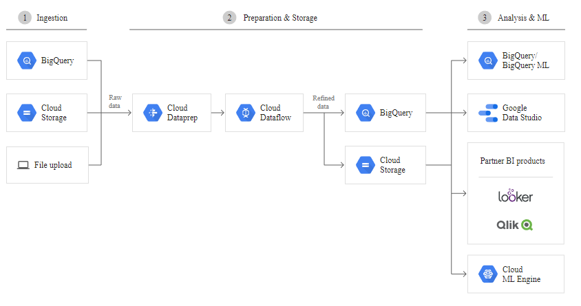

# Dataprep

Helps prepare your data.

  - Clean and transform data via web UI/ click and point interface (recipe)
    - Transform data from a less useable to a more useable format
  - Runs on top of managed Cloud Dataflow jobs 
  - Can schedule regular batch transformation jobs from Cloud Storage/BigQuery

### What problem does it solve?
  
  - Data for analysis is in wrong format/needs cleaning
  - Need automatic *cleaning jobs* performed on regularly added data - schedule jobs

### Role in the data lifecycle?

  - Data processing - uses Dataflow in easy point/click format

