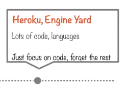
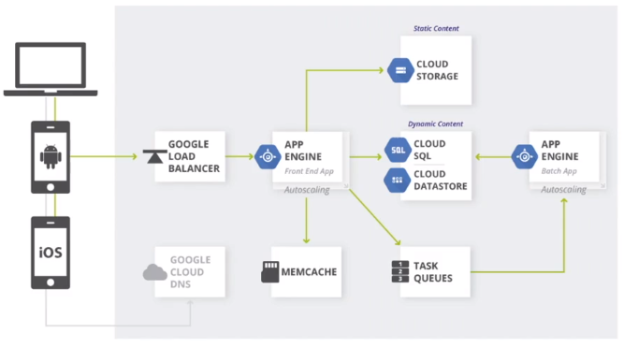

# App Engine

## Hosting on App Engine

Using GCE and GKE requires a fair amount of low level thought.

If you don’t want to deal with any low level consideration and are just interested in writing the code. App Engine allows you to leave the details to the platform.
If you are used to using standard **PaaS** web development tools/technologies such as Heroku and Engine Yard you may choose the GCP equivalent **App Engine.**

Using App Engine you can build a pretty complex web app with very little effort - you just focus on writing the code. In the example above the web app is supporting a range of different clients with load balancing in the front of the app and It's able to leverage cloud DNS. App Engine will use MEMCHCHE to speed up common datastore queries. In the backend it will use whatever storage technologies it requires. App Engine also has a built in autoscaling functionality that you are able to take advantage of.

The App Engine is a **serverless** architecture, so it's better to refer to App Engine instances as App Engine environments. 

## Environments

There are two types of environments that represent the **PaaS** on Google Cloud:

 - **Standard**
    - This is pre-configured with Java 7, Python 2.7, Go, PHP, etc.. **This is actually a container** and you can't change anything.
	
 - **Flexible**
    - More choices such as Java 8, Python 3, .NET, etc… Or other non-standard environment. **This is actually a compute engine VM.**

### App Engine Standard Environment

 - Based on **container instances** running on Google's infrastructure. **That are in-turn running on GCE VM's.**
 - Preconfigured with one of several available runtimes (Python 2.7, Go, Java 7, PHP, etc..).
 - Each runtime also includes libraries that support App Engine Standard API's.
 - A lot of the time this is all you need.
 - Applications running in the standard environment are running in a secure, sandboxed environment. 
 - In the background the standard App Engine uses Googles infrastructure to **distribute requests across multiple servers** and scales to meet traffic demands.
    - All of this is completely transparent to you, your application runs within its own secure reliable environment that is independent of the hardware, OS or physical location of the server.

### App Engine Flexible Environment
 
 - Based on a **GCE VM instance.**
 - Allows you to **customize your runtime and OS of your VM using Dockerfiles.**

## Cloud Functions

Cloud functions are *"floating"* bits of functionality that run in a **serverless execution environment** for connecting and building different services.
The idea is to write **simple**, single purpose functions and attach them to **events** emitted from your cloud infrastructure such as logging. Every time the specified event being watched happens, the cloud function is triggered.
**Cloud functions are serverless** and therefore **should not be associated with any disk or persistent storage of any sort**. The code will be executed in a fully managed environment and you should not worry about provisioning any kind of infrastructure/servers. Cloud functions are **written in JavaScript and run in any standard Node.js runtime.**