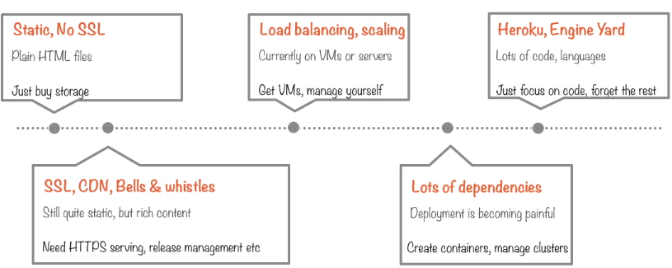
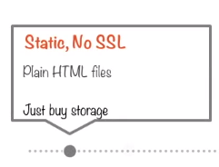

# Compute Options

GCP offers three compute options for running cloud apps.
	
1. **Google App Engine** is the **PaaS** option - serverless and ops-free.

2. **Google Compute Engine** is the **IaaS** option - **fully controllable** down to OS layer.

3. **Google Container Engine** lies in between - clusters of machines running Kubernetes and hosting containers. Here you as the consumer of the cloud platform setup clusters of machines, these are running a container management service called Kubernetes. Containers are images of your binaries that have been dockerized. Kubernetes and GCP will take care of running these. With this option you have a lot of control, much more than the App Engine offers but much less than the Compute Engine.

## Hosting Web Content: A Case Study of Compute Options

Some common cloud use cases could include:

- Hosting a website - Relatively basic.
- Running a Hadoop cluster - Big data .
- Serving a Tensor Flow model - ML neural network library.

Across all of these options the cloud architect will need to make the decision of what compute options are going to be used. - *What kind of machines do you want to have running your software and who is going to control those machines?*

### Hosting a Website

The simplest of the above options is hosting a website. But even this option can range from extremely simple to much more complex.

In the above diagram there are varying levels of complexity from left to right:

- The simplest use case where there is a static website with no SSL, just plain HTML files. All you need is storage space to host those files. - Just buy storage.

- If the website is a bit more complex and an SSL layer is needed maybe for a checkout. There is also rich content so a CDN is required. In this case HTTPS serving is needed, its more complicated than the previous case, but still quite static.

- The next level up in sophistication comes when a need for load balancing and scaling is needed. This is required when you have a complex backend and a large amount of traffic hitting your web app. The web app needs to be smart enough to direct traffic to the appropriate back end service. This often requires multiple VM's that can be fully managed yourself.

- Having lots of dependencies across those VM's can be hard to manage. A micro-services architecture using containers can be suitable here. 

- The last case in the diagram represents a position where a web app is becoming very cumbersome. At this point Heroku or Engine Yard can help. These in theory allow you to just focus on the code and leave other complex decisions to the framework. This is a way to retreat away from some of the complexity as the sophistication of your app increases. Here you can forget about optimizing all the containers and DevOps infrastructure and just focus on the code.

Each case above is encapsulated in an option provided by GCP.

### Google Cloud Storage

The first case is where we just have some static HTML files and all we need is some storage to host them. This is very simple and not recommended. The option that would support this is Google Cloud Storage. To do this, create a bucket and upload content. GCP will provide an endpoint storage.googleapis.com or your own domain. Your of course still need to write own HTML CSS or can use static generators like Jekyll, Ghost or Hugo. There are a few options to upload content into a bucket:
 - Copy content over to bucket directly:
    - Web Console
    - Cloud Shell
 - Store on GitHub and use web hook to run update script.
 - Use CI/CD tool like Jenkins and use a plug-in for post-build step.
Cloud storage is a very basic option, but it is a cost effective one if all you need is to serve static content.

### Firebase Hosting + Google Cloud Storage

If a little more functionality is required specific to website hosting. Things like SSL connections, HTTPS serving and a global CDN. Automatic deployment and one-click rollback is also often needed.
In this case we can use **Firebase Hosting + Google Cloud Storage**. Firebase hosting is built into GCP and it allows a us to turn on HTTPS serving, end users can tap into a global CDN for quick cached access to large content metadata files. It also offers atomic deployment and one-click rollback. Firebase Hosting with Google Cloud Storage is really just a storage option with a few automatic extras. It's still quite a basic option no code has yet been deployed and the web app is still not doing anything intelligent. This is where the other compute options come into play.

