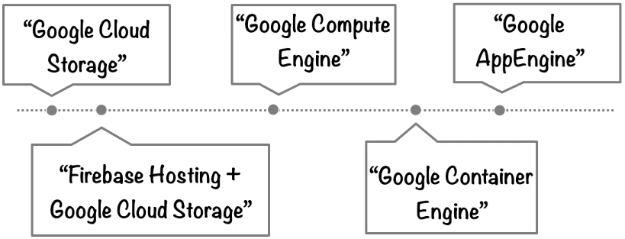

# Contrasting Compute Options

## Hosting a Website

Using the same case study as below, all the compute options have been analysed.

The first two options are very basic storage based options, followed by the three important compute options on GCP.

| <h3> App Engine </h3> |  <h3> Container Engine </h3> | <h3> Compute Engine</h3> |
| <h4>PaaS     </h4>       |<h4>  Hybrid Service   </h4>  | <h4> IaaS         </h4>           |
|:---------------------------|:-------------------------------|:--------------------------------|
|  A flexible, zero ops (serverless) platform for building highly available apps. Should be used if high availability is very important as it removes the operation of scaling up and down additional instances. | Logical infrastructure powered by Kubernetes. You don’t need to manage individual containers but you do need to work with Kubernetes. This abstracts a lot of DevOps infrastructure work but some is still necessary. | VM's running in Googles global DC network. You are directly responsible for everything.
| You only want to focus on writing code, and never want to toucher a server, cluster or any infrastructure. | You want to deploy apps very fast and improve operability by separating the app from the OS. | You need very granular control over infrastructure and direct access to high-performance hardware such as GPU's and local SSD's.
| You neither know or care about the OS running your code.| You don’t have dependencies on a specific OS. | You have a strong opinion on what OS to run and need to make OS level changes such as network or graphic drivers to increase performance.
| Websites and Mobile apps.   If architecture makes heavy use of RESTful API's due to service separation/isolation.(HTTP invocation only way for services to execute remote code). | Any kind of containerized workload. For instance if you already have containers running on-premise and want to move them to GCP for immediate functionality.  Cloud native distributed systems.| Any workload requiring a specific OS or OS configuration.  Can't be containerized easily or need existing VM images.| 

#### Mix-and-Match

It is entirely possible to use multiple options for a single solution. For example:

 - Use **App Engine** for the front end serving layer, while running Redis in **Compute Engine.**

 - If you have a heavy graphics intensive application where a lot of frame rendering is needed. Use **Container Engine** for a rendering microservice with a load of node instances in a container cluster while the **Compute Engine VM's with a GPU** doing the actual frame rendering hooks back up to the cluster.

 - Use App Engine for web front end, transaction processing using Cloud SQL database and big data processing using Hive (not Big Query) running on compute engine.

## Summary

App Engine, Compute Engine and Container Engine and GCP's three compute options.

 - **App Engine** is the **PaaS** option - serverless and ops-free.

 - **Compute Engine** is the **IaaS** option - fully controllable down to OS.

 - **Container Engine** lies **in-between** - clusters of machines running Kubernetes and hosting containers. 

