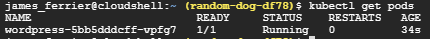

# Creating A Kubernetes Cluster

## Creating a Cluster

To create a cluster called my-first-cluster with 1 node:

```bash
gcloud container clusters create my−first−cluster −−num−nodes 1
```


Because container clusters are simply a load of VM instances running together in some configuration you can use gcloud compute commands to verify:

```bash
gcloud compute instances list
```


Now that there is a cluster up and running we can deploy something to it. In this case we will deploy a WordPress Docker container to the single node cluster. This is a publicly available image. We want this application to run over port 80. This tutum image contains everything needed to run a wordpress site including a SQL database.

```bash
kubectl run wordpress --image=tutum/wordpress --port=80
```


By deploying this container to the cluster we have created a pod with one container inside.

We can see the status of the current pods with the following:

```bash
kubectl get pods
```




The status is ready  - 1/1 - running. We only have 1 container in the pod.

When a pod is first created, by default its only accessible by other internal machines in the cluster. As we are creating a webpage we want to expose the pod as a service so it can be accessed externally.

```bash
kubectl expose pod wordpress-5bb5dddcff-vpfg7 --name=wordpress \
--type=LoadBalancer
```

The above command exposes the pod externally and the LoadBalancer switch creates an external IP address that this pod can use to accept traffic.

We can check the information of the service that we named wordpress:

```bash
kubectl describe services wordpress
```


At the bottom there is events, currently the LB has not yet been created.


Running the command again shows another event stating the LB is ready and a LB ingress IP has also appeared.


If we web browse to the address listed we get the wordpress start up page.
