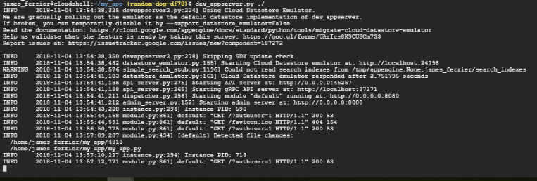
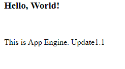
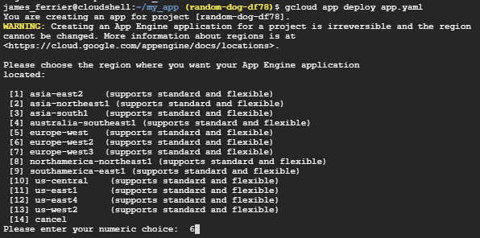
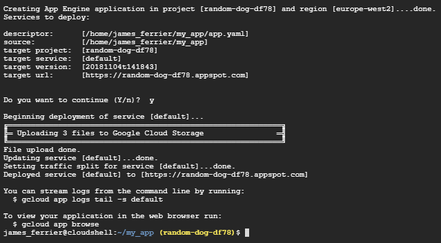

# Deploy App into App Engine

## Deploy an App

Google App Engine lets you deploy an app very quickly. You simply worry about writing the app code and then choose the correct runtime and sdk to deploy. There are no clusters to maintain and no VM instances to worry about.


### Web App Code

Web app code is in the following **my_app.py**

```python
import webapp2

class HomePage(webapp2.RequestHandler):
    def get(self):
        self.response.headers['Content-type'] = 'text/html'
        self.response.write('<h3>Hello, World!</h3><p>This is App Engine.</p>')

app = webapp2.WSGIApplication([
    ('/', HomePage),
], debug=True)
```

Above is a very simple web app written on the cloud shell in python. It uses the webapp2 package that is a very lightweight python web framework that is compatible with Google App Engine.
We have a class called HomePage that derives from **webapp2** request handler method. Within the class the get method holds the content of the web page. The response property contains the response that will be sent to the client browser. The webserver gateway interface application will receive requests and route them to the appropriate page.

### Application config settings for App Engine

App Engine settings are specified in a file called **app.yaml**

```yaml
runtime: python27
api_version: 1
threadsafe: true

handlers:
        - url: /.*
          script: my_app.app
```

This specifies that the runtime environment for the app and the handlers. The handlers are mapping from URL path to static files. In this case / or any URL will map to the python module created above.

### Deploy instance of Application Server

Start the app server by running the following command and pointing to the python web app (current dir).

```bash
dev_appserver.py ./
```



Auto refresh is supported for changes to code.

Browsing to localhost on the cloud shell brings up the page:




### Deploy to Production 

Now the app has been tested in the development environment, it can be deployed into production. 

```bash
gcloud app deploy app.yaml
```






This will upload the files into storage and provide you will the URL to access the site. 
This is now complete and the web app is deployed to production **without configuring any VM instances or containers.** This is because the App Engine is a **serverless abstraction** and you do not need to specify one. Google will automatically scale up the application if the traffic demands it.


To view logs of the site run the following command:

```bash
gcloud  app logs tail −s default 
```

Currently need to delete project to delete app.

```bash
gcloud projects delete <project_id>
```