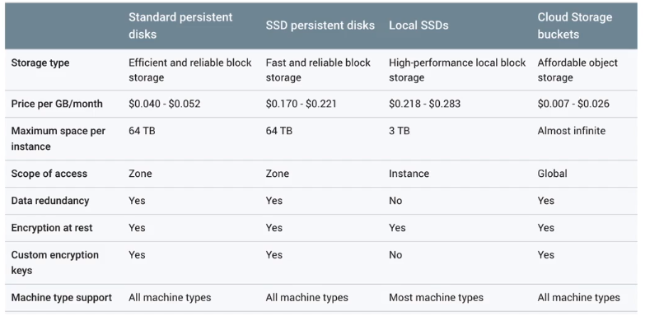
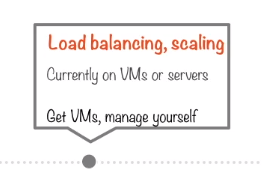

# Google Compute Engine (GCE)

The need for compute options becomes apparent when you get to situations when you need to think about load balancing and scaling.

## Google Compute Engine

Here we have a load of backend instances doing separate tasks, each one doing different types of computational processing or accessing a DB layer.
Now there are clear differences between the operations being carried out by the different parts of the web app. This is where you would like a higher level of control on load balancing and scaling yourself.
This represents a typical IaaS, you would have a load of VM instances and you can set them up however you want. Configuration, administration and management is all your responsibility.
This sounds like an on premise scenario but there are clear differences. You don’t need to buy machines or install an OS and auto-scaling is taken care of. You simple specify the OS, dev stack, languages etc. the **IaaS** option on GCP is called **Google Compute Engine.**

### Hosting with Compute Engine

GCE adds a lot of features and complexity to think about when hosting a web app compared with storage only options. However there are still lots of "helper" features to make it easier.

#### Google Cloud Launcher

Google Cloud Launcher is a very easy way of deploying a full web serving stack. Cloud Launcher can deploy a LAMP stack or WordPress application in a few minutes. Before you deploy, you get pretty accurate cost estimates.
You still choose machine types, disk sizes before deployment. After deployment you have full control of machine instances.  

#### Storage Options

When you make use of VM instances, there are some storage options to be aware of:
- Cloud Storage Buckets
-  Standard persistent disks
- SSD persistent disks
- Local SSD - attaches to individual instance

There are loads of storage technologies that code and applications running on your VM can use such as:
- Cloud SQL - comes with MySQL and PostgreSQL implementations.
- NoSQL - HBase and Hive.

#### Load Balancing Options

Compute instance gives you granular controls on load balancing operations. Able to load balance at multiple places in the OSI stack.
- Network load balancing - forwarding rules based on address, port, protocol. Layer 4.
- HTTP load balancing/application - look into content, examine cookies, session affinity, certain clients to one server etc.. Layer 7.
The more sophisticated the load balancing operation you want to achieve, the higher up in the stack you need to go. For example at layer 7 you can specify that all video requests go to a particular instance and regular web request go to another.

All of these LB operations are supported natively by GCP. But are also offered by 3rd party provider such as:
- **Nginx**
- **MS IIS** - cross region LB

When using a GCE cluster, you can carry out internal LB operations (private network, not internet) that can be auto-scaled. Products such as **HAProxy** and **Consul** provide this.

### DevOps

If already using a range of DevOps tools in-house, you can continue to use them. 
- Compute Engine management with **Puppet, Chef, Salt** and **Ansible**.
- Automated image builds with **Jenkins**, **Packer** and **Kubernetes**. 
- Distribute load testing with **Kubernetes**.
- Continuous delivery with **Travis CI.**
- Managing deployments with **Spinnaker**.

A lot of these DevOps tools have equivalents in GCP if you device to use native tooling.

#### More GCE Design Choices

When spinning up a new VM instance one of the first choices you need make is that of operating system. 
- GCP provides a range of public images for Linux and Windows server.
- Private images that you create or import to Compute Engine.

When creating an instance specify:
- Zone
- OS
- Machine type

The creator of an instance has full root privilege and SSH capability. The creator can share these privileges with other users.

#### Machine Types

There is a range of machine types available to a GCP user but the idea is that each one is part of the following model:
- Standard
- High-memory
- High-CPU
- Shared-core - very small, non-resource intensive
- Can attach GPU to most machine types for ML application

#### Projects and Instances

- Each instance belongs to a project.
- Projects can have any number of instances.
- Projects can have up to 5 VPC's.
- Each instance NIC belongs in one VPC.
- Instances within VPC communicate over LAN.
  - Instances across VPC communicate over internet.

#### Preemptible Instance

A Preemptible Instance is a type of instance that is **much** cheaper than the regular GCE instances. But it can be terminated **at any time** if Compute Engine needs the resources. For this reason its use cases can be for fault-tolerant applications. Examples of this could be a processing only node in a Hadoop cluster.

Preemptible Instances details:
- Will **definitely** be terminated after running for 24 hours.
- Probability of termination before 24 hours varies by day/zone/time/etc..
- Cannot live migrate (stay up during updates) or auto-restart on maintenance. 

Preemption Steps:
1. Compute Engine sends a **soft off signal**. - 30 second warning.
2. You should have a shutdown script to clean up and give control within 30 seconds.
3. If not, Compute Engine sends a **mechanical off signal.**
4. Once the 30 seconds is up, or your script gave control, Compute Engine transitions to **terminated state.**

#### Availability Policies

- When creating a new instance there are three availability policies to configure:
  - Preemptibility
  - Automatic restart - If a instance shuts down this will bring it back up automatically it’s a recommended setting and enabled by default.
  - On host maintenance - If your machine is taken down by google for maintenance then you have two choices:
    - Migrate this VM to another machine so that your processes can continue uninterrupted. - Recommended.
    - Shut down all together.

#### Storage Options

Each instance comes with a small persistent disk containing the OS.
Additional storage options:
- Persistent disk
  - Standard
  - SSD
- Local SSD - attached to instance
- Cloud Storage
Persistent disks (both standard and SSD) are abstractions, to the instance they will seem like dedicated storage but in fact they will be wired up to some kind of redundancy mechanism doing striping. The local  SSD is actually attached to the instance, it is not redundant but they are extremely fast.

The above table compares the storage options available to instances. In terms of cost Cloud Storage is the cheapest and both SSD options are the most expensive. Persistent disks need to be in the same zone as the instance they are attached to. This is because they are attached using high speed connections only available in the same zone.

### Summary - Hosting a Website

In summary the GCE option is an IaaS offering, you are taking control of the environment that you want your code running on and you are responsible for making it work. You are in control of load balancing, scaling and storage options etc. This is much more involved that just using Google Storage with or without FireBase hosting.

