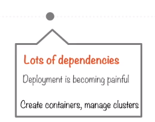
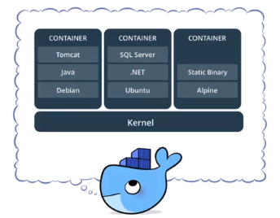
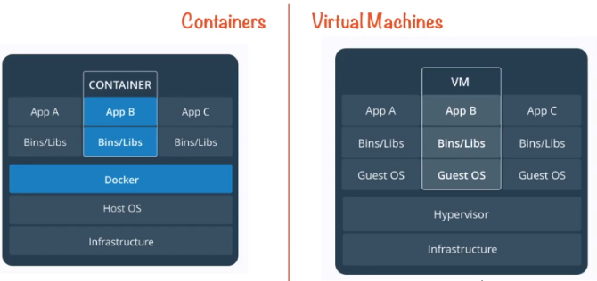
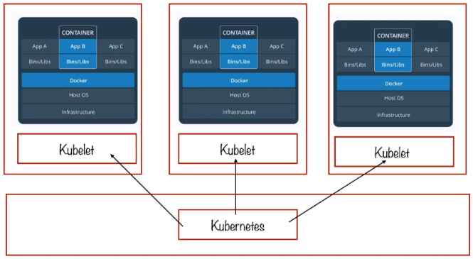

# Google Container Engine (GKE). Pt 1

## Hosting a WebApp

In this case study we have a webapp with a lot of dependencies, there is a fairly typical architecture with a database behind a layer of web logic. This requires you to run separate webserver and database instances.
You want to use containers to isolate each from the other. This is what a service-oriented architecture looks like. 
A microservices style architecture is many containers all communicating via REST-API.

It is possible to use the IaaS offering in this scenario as well and spin up a large number of GCE VM instances and run Kubernetes on each of them to create your own container environment. However if you would rather save yourself the hassle of managing your own container cluster, just make use of **Google Container Engine.**

### Container

*"A container image is a lightweight, stand-alone, executable package of a piece of software that includes everything needed to run it: code, runtime, system tools, system libraries, settings."* - docker.com

As the image above suggests there can be multiple containers running on the same OS kernel. Each one of these containers effectively has its own environment - executables as well as the entire runtime setup. All of these containers can be created using software such as Docker. Docker can be thought of as a build tool that takes in your code and outputs a container that acts as a sandbox for your code. Individual containers are often in the docker file format these containers put into a cluster and managed by software known as Kubernetes.

### Containers vs VM's

The difference between containers and VM instances is very relevant to your choice between GCE and GKE.

Above is a graphical representation of the difference between a container and VM. This is taken from the docker website so approaches containers from a docker standpoint.
On the container side you can see that the layer directly underneath the containers lies Docker. Docker is a platform that allows you to build and run distributed applications in the form of containers. The crucial point is that **Docker runs on top of the OS** this means that each individual container does not abstract the OS.
In contrast to the VM side, each VM has its own guest OS and underneath each VM lies the VM monitor or Hypervisor. The Hypervisor is a piece of software (VMWare) that ensures multiple VM's are able to run on the underlying hardware.

Containers offer one further level of abstraction, this makes them different from VM's as they virtualize the OS. In the diagram above you can see that Docker acts as a proxy between the container and the OS. In a VM though each one has its own OS which talks to the VM monitor, the monitor then abstracts the hardware.

| Containers | Virtual Machines |
|:------------:|:------------------:|
|Virtualize the OS | Virtualize hardware|
| More portable | Less portable |
| Quick to boot | Slow to boot |
| Size - tens of MBs | Size - tens of GBs |

The above table aims to show how a container is much more lightweight that a VM.

### Container Cluster

When choosing to use GKE you are effectively running a container cluster.

The above diagram shows what a container cluster will look like. At the bottom is the supervising machine and in Kubernetes this is known as the **master node**. This can be thought of as like the Hadoop cluster manager. This will be in contact with a number of individual container machines each running containers and each communicating with the master using software known as a Kubelet.

In GKE the coordinating machine is known as the **master node** and it runs Kubernetes, each of the other machines in the cluster are known as **node instances.** Each node instance has its own **Kubelet** talking to the master and on top of the Kubelet runs a **pod**. **Inside each pod are multiple containers.** The master talks to node instances which in turn contain pods and those pods contain the containers. 

### Hosting with Container Engine

Containers are a much newer technology that VM's. If you decide to host your webapp using GKE the need for a large DevOps resource is largely mitigated. It's still plausible to use Jenkins for CI/CD but to a large extent you can get everything you need accomplished by Kubernetes. Jenkins can be setup to work with GKE quite seamlessly and can be used for CI/CD and just make use of the container engine functionality for things like packaging and deployment.

StackDriver is available for logging and monitoring.

## Advantages

Containers have some real advantages for this particular case of web serving.

- **Componentization** - **Separating** the different components for instance the webserver and the database, they need to be isolated from each other. You don’t want the application layer directly touching the database and bypassing the webserver logic. All of this leads to a **service oriented architecture known as microservices**. This specific use case is one of the main reasons containers have become so popular.

- **Portability** - Because a container has everything it needs to run, (not the OS obviously) the container is easily shippable. You are essentially shipping your **application as well as its dependencies in one compact bundle.**

- **Rapid deployment** - In contrast to VM's, **containers do not need to take along an OS**. This means that you can build a system from a set of image definitions which can also be encapsulated using an image registry. 

- **Orchestration** - Kubernetes clusters. GKE uses Kubernetes in the form of clusters, so there is one master entity that is **controlling all the individual node instances**. Kubernetes and master instance greatly **reduce the amount of orchestration required**. Instead of administering individual containers or even the individual pods or creating or shutting down each container manually, you now can do all of this through the container engine using various config files.

- **Image registration** - Pull images from container registry. It is possible to register container images to a registry and then pull them. This is a very useful **code reuse mechanism**.

- Flexibility - mix-and-match with other cloud providers and on premise?

