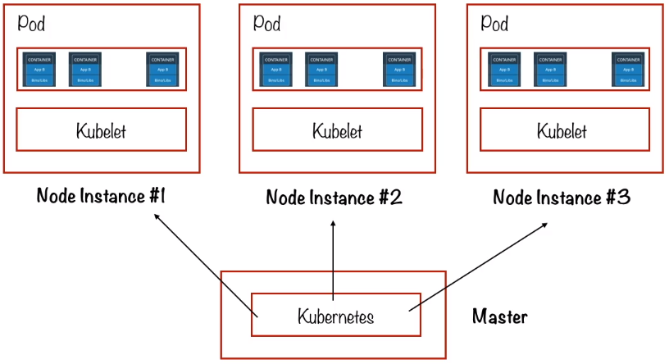
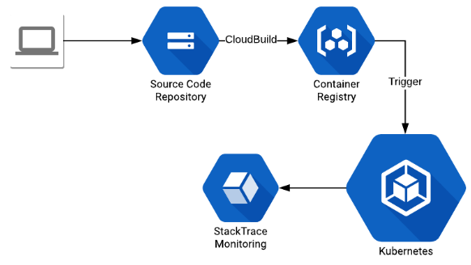

# Google Container Engine (GKE). Pt 2

## Storage

Storage options are largely the same as with Compute Engine. However, the data on a Compute Engine attached disk is persistent meaning that even if the disk is detached and put onto another instance the same files will be there.
This is not the case with containers, the **on-disk files are ephemeral**. If a container restarts, all the data on the disk is going to be lost. The way around this ephemeral nature of storage options by using a **persistent disk abstraction** called **gcePersistentDisk**.

## Load Balancing

Load balancing is an area that is more complex when working with GKE that GCE.
With the Container Engine, there is **network layer load balancing that works out-of-box.** For more sophisticated load balancing like HTTP load balancing, you need to integrate with Compute Engine load balancing.

## Container Cluster

The above diagram shows the general architecture of a Kubernetes container cluster. There is a **master node running Kubernetes**, this controls a number of **node instances which have Kubelet's** and **inside those Kubelet's are containers**. Kubernetes in open-source container management software created and maintained by Google. Kubernetes encapsulates all of the container functionality available on GCP.

**Kubernetes is the orchestrator that runs on the master node,** but it really depends on the Kubelet's that are running on the pod. **A pod is a collection of containers that all share the underlying resources,** for instance they will all have the same IP address and will share disk volumes. An example might be a webserver pod that would have a container for the server and then containers for the logging. Pods are defined using configuration files in JSON or YAML. **Each pod is managed by a Kubelet** and that **Kubelet is in turn controlled by the master node running Kubernetes**.

This diagram representation also hints at how container clusters are really architected in the GCP world. **In effect a container cluster is nothing more than a group of Compute Engine VM instances each of which is running Kubernetes.**

The VM instances that are contained within a container cluster are of two types:

- One or more node instances running Kubelet's that manage pods.
- A master instance running Kubernetes.

### Node Instances

Node instance properties:

- Managed from the master.
- Run the services necessary to support Docker containers that contain the code being executed.
- Each node runs the Docker runtime and hosts the Kubelet agent. This Kubelet agent manages the docker runtime and also make sure that all of the docker containers that are scheduled on the host are running successfully.

### Master Endpoint

Master endpoint properties:

- Runs the Kubernetes API server, which:
    - Services REST requests.
    - Schedules pod creation and deletion on node instances (worker nodes).
    - Synchronizes information across the different pods, such as open ports and location.

### Node Pool

Within a container cluster it is common to have different instances that are similar to each other. A node pool can be useful here:

- Subset of machines within a cluster that all have the same configuration.
- Useful for customizing instance profiles in a cluster. Especially if frequent changes are made.
- You can also run multiple Kubernetes node versions on each **node pool** in your cluster. Then have each of those node pools independently listen to different updates and deployments. Node pools are a powerful way of customizing the different instances in a cluster.

### Container Builder

Tool that executes your container image builds on GCP infrastructure.

- Build steps:
    - Import source code from a variety of repositories or cloud storage spaces.
    - Execute a build to your specification.
    - Produce artefacts such as Docker containers or Java archives.

### Container Registry

- Private registry for Docker images.
- Can access (push, pull and manage) container images from any system whether it's a Compute Engine instance or your own hardware through secure HTTPS. This is a controlled way of dealing with container images.
- It is possible to hook up Docker and the Container Registry so that they talk to each other directly. Do this by configuring Docker to authenticate directly with Container Registry.
- Because the Container Registry can be read from and written to from pretty much any system, it is also possible to use 3rd party cluster management, CI/CD or other solutions outside of GCP.

In the diagram above, the source code is built and packaged into a docker container using cloud build. Once the image is stored in Container Registry, it is deployed and run inside GKE.

1. Build it
2. Push it
3. Deploy it
4. Run it

### Scheduling

Scheduling is the term used to describe the process of the cluster deciding where to put a new pod. If you tell the cluster to start a pod, the cluster will look at all the available nodes and decide where to put the new one. It bases this decision on comparing available resources with what the pod declares it needs.

### Autoscaling

A basic and fundamental of any CSP is autoscaling of services. GKE has its own version.

- Automatic resizing of clusters with **Cluster Autoscaler.**
    - Cluster Autoscaler periodically checks whether there are any pods waiting, resizes cluster if needed.
    - Also monitors usage of nodes and deletes nodes if all its pods can be scheduled elsewhere.
- Aims to optimize the size of the cluster by either increasing or reducing the number of instances.

In an example your cluster might be larger than in needs to be (there are nodes that do not have any pods scheduled) then those nodes will be deleted by the cluster autoscaler. The other side is that if your cluster is too small and there are pods that face large delays before being run, then the cluster autoscaler will add nodes and scale up the size of the cluster.

This autoscaling feature is not an option under the GCE choice and this is one reason someone might go with GKE over GCE. Things like autoscaling are taken care of but we still retain a certain level of control.
