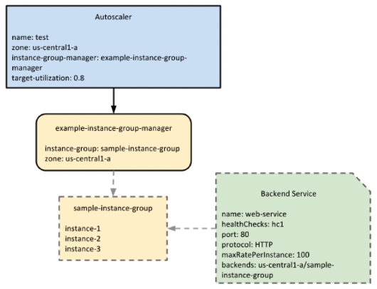

# Autoscaling

 - **Managed instance groups** automatically add or remove instances based on increases and decreases in load.
 - Helps your applications **gracefully handle increases in traffic**.
 - **Reduces cost** when load is lower.

Autoscaling is a feature of **managed instance groups**.
**Unmanaged instance groups are not supported**.
Unmanaged instance groups are for instances of different type there is no commonality between the VM's.

For **GKE** groups autoscaling is different, called **Cluster Autoscaling**.

In order to set up autoscaling for a managed instance group there are 2 things that we need to define:
  - Autoscaling Policy
    - What metric will be used to autoscale instances.
  - Target Utilization level
    - What threshold does the metric need to reach.

### Autoscaling Policy

The autoscaling policy can be based on 4 different metrics:
 - Average CPU utilization of all instances in a group.
 -  Stackdriver monitoring metrics.
    - These can be built in or custom metrics.
- HTTP(S) load balancing server capacity
  - CPU utilization or requests per second per instance.
- Pub/Sub queueing workload.

### Target Utilization Level

Once a autoscaling policy has been chosen, a target utilization level is needed.

- The level at which you want to maintain your VM's.
  - If the metric that you have chosen for the autoscaling policy goes beyond this level then the autoscaler will add VM's, if it falls much below this level the autoscaler will remove VM's.
- Interpreted differently based on the autoscaling policy that has been chosen.
  - For example, if you choose a stackdriver custom metric that is based on the number of users that are currently connected to a system. In this case the target utilization level might be a integer that represents the number of users that are active.

#### Average CPU Utilization

 - Lets say we want a target utilization level of 0.75. This means that the average CPU utilization should be 75% **across all instances**.
 - If utilization exceeds the target, **more CPU's will be added** to bring the average down.
 - If utilization reaches 100% during times of heave usage the autoscaler might increase the number of CPU's by either: 
   - 50%
   - 4 instances
     - whichever value is **larger**

#### Stackdriver Monitoring Metrics

Stackdriver provides a load of common metrics that are available for any VM instance.

 - Can configure the autoscaler to use **standard** or **custom** metrics to make scaling decisions.
 - Not all standard metrics are valud utilization metrics that the autoscaler can use.
   - The metric must contain data for a single VM instance, it cant contain data for a group of instances. **Needs to be VM specific.**
   - The metric must define in some way **how busy the resource is**, the metric value increases or decreases proportional to the number of instances in the group.
     - Both of the above are nessesary conditions for the metric to be used as in a autoscaling policy.

#### HTTP(S) Load Balancing Server Capacity

Here is a block diagram example of how a autoscaler works with a backend service for HTTP(S) load balancing.

Within the autoscaler you will set a **target-utilization** level, in this case 0.8. This autoscaler interacts with the instance group manager that manages the instance group that is part of the backend service. Within the backend service, you configure one of the metrics, either **maxRatePersistance** as is the case here or **cpuUtilization** level.

  -  Only works with:
      - **CPU utilization**
      - maximum requests per second per instance
  - These are the only metrics that can be controlled by adding and removing instances.

Autoscaling **does not** work with maximum requests per group.
This setting is indepened of the number of instances in a group. It does not change when you add or remove instances from a group.

#### Autoscaler with Multiple Policies

Autoscalers can make scaling decisions based on multiple policies, it does not need to rely on just a single policy.
The autoscaler will scale based on the policy that will provide the **largest number of VM's** to the group. 
This ensures that you always have enough machines to handle your workload.
An autoscaler can work with a maximum of **5 policies** at a time.

#### Example Policies

**cpuUtilization** with target of 0.8
**loadBalancingUtilization** with target of 0.6
**customMetricUtilization** for *metric1* with target of 1000
**customMetricUtilization** for *metric2* with target of 2000

If the instance group is going over the target on a couple of these targets, it will calculate how many VM's it needs to add to bring each metric back to the threshold. It will then add the highest number it calculates.