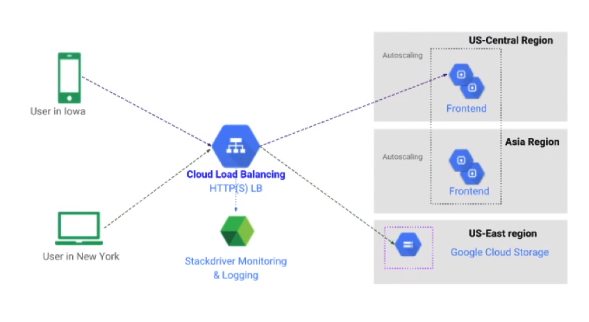

# Backend Service and Backends

The backend service is a centralized service that manages the various backends that sit behind the load balancer.

A backend is a **logical group of servers** that knows how to handle a particular kind of traffic. There might be a backend that handles video traffic, another for audio, another for static content, etc...
**A backend service manages a number of these backends.**

A single backend is made up of 1 or more instance groups, these can be managed or un-managed. These instance groups contain the machines that actually handle the user requests.

The backend service knows which instance is can use and how much traffic each of them can handle. It has an idea of the CPU utilization and number of requests per instance per second.

Backend service is also responsible for monitoring the health of the various backends that is manages, and only sends traffic to healthy ones.

### Backend Service Components

- **Health Check**: Polls instances to determine which one can receive requests.
- **Backends**: Instance groups (managed or un-managed) of VM's capable of recieving requests.
  - If its a MIG then it can autoscale.
- **Session Affinity**: Attempts to send requests from the same client to the same VM.
  - IP of client
  - Cookie
- **Timeout**: Time the backend service will wait for a backend to respond.

#### Health Checks

The various types of health checks available:

- HTTPS(S), SSL and TCP
- **HTTP(S)**: Highest fidelity - Verifies the instance is healthy and the web server is serving traffic.
- **TCP, SSL**: Used when the service expects TCP or SSL connections **and not HTTP(S)**
- GCP creates redundant copies of the health checker automatically so health checks might happen more frequently than you expect.

#### Session Affinity

Session affinity can be achieved by 1 of 2 methods:

- **Client IP**: Hashes the IP address to send requests from the same IP to the same VM.
  - Requests from different users might look the same (all behind proxy) this will send all to 1 server.
  - Mobile users or users who change networks might loose affinity when they get a new IP.
- **Cookie**: When a VM sees a request for the first time it will issue a cookie called GCLB with a value.
  - Subsequent requests from clients with the cookie value are sent to the same instance.

#### Backends

A backend is another term for an instance group.

- **Instance Group**: Can be managed or un-managed.
  - MIG is made up of similar instances from a template. It supports autoscaling.
  - Un-managed instance group is made up of non-similar VM's and is not usually recommended.
- **Balancing Mode**: Determines when the backend is at full usage.
  - This is the metric the LB uses to decide the capacity a particular backend has.
  - Scales linearly with traffic and will decrease with adding new instances to the MIG.
  - Based on CPU utilization, requests per second.
- **Capacity Setting**: A % of the balancing mode which determines the capacity of a backend

#### Backend Buckets

Backends can be VM instances that are part of an instance group, or they can be **backend buckets**. These are GCS buckets that are capable of serving static content.

- Allows you to use Cloud Storage buckets with HTTP(S) load balancing. 
- Traffic is directed to a bucket instead of a backend instance.
- Useful in load balancing requests to **static content**.

Below is a simple architecture diagram of how HTTP(S) load balancing with backend buckets.

Customers or clients on the left can be distributed across the word.
The requests they send are first sent to a Cloud Load Balancer that has backends as well as backend buckets to which it distributes traffic.
A path of /static can be sent to the storage bucket.
The MIG's run the frontend of the application and all other paths are forwarded here.