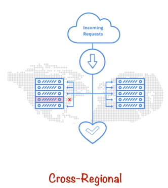
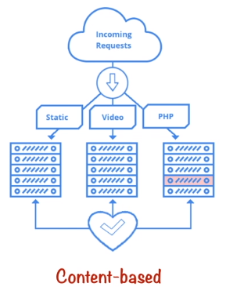

# HTTP(S) Load Balancing

The HTTP(S) LB is an external global LB. It is typically configured for client requests or web traffic for an application.
As its an external LB, it will serve traffic from clients or customers over the internet. 
As its global it can distribute traffic across multiple regions all over the world.

Its at the highest layer of the OSI stack so it has the most information as to where the packet should be distributed. - HTTPS LB is the *smartest* way to LB.

The HTTPS LB is capable of distributing traffic among groups of instances based on:
- Proximity to the user (globally)
- Requested URL - Split traffic based on URL
  - If the request is for static content, the request can be sent to one group of instances.
  - If the request is for home page or product info on an e-commerce site, the request can be sent to another group...
  - etc...
- Or both of above
  - It will find the best instance based on the URL requested, and then the closed one to the user

### HTTP/HTTPS Load Balancing

Below is a block diagram of all the components which make up the HTTP(S) LB on GCP.

@startuml
:Internet;
->
:Global Forwarding Rule;
->
:Target Proxy;
->
:URL Map;
->
if (Backend Service) then
  partition Backend {
  -[#blue,dotted]-> Health Check;
  :Instance Group;
  detach
  }
else
  partition Backend {
  -[#red,dotted]-> Health Check;
  :Instance Group;
  detach
}
@enduml

1. Traffic from the internet is sent to a global forwarding rule - this rule determines which proxy the traffic should be directed to. A forwarding rule is just a rule that points to a proxy that the traffic should be directed to.
2. For a HTTPS LB the GFR points to a HTTP proxy.
3. The target proxy uses a URL map to check each request to determine the appropriate backend service for the request. **(HTTPS requires the proxy to have signed cert to terminate SSL conn)**
4. The backend service is split into 1 or more backends. Every backend is made up of 1 or more instance groups, these can be managed or un-managed instance groups **(MIG supports autoscaling)**. Every backend is capable of responding to a particular kind of request, so the backend service will direct each request to the appropriate backend based on a number of factors. - Proximity to user (zone), serving capacity and instance health. serving capacity can be broken into CPU utilization and requests per instance per second.
5. Every backend instance is monitored using HTTP(S) health check.

Firewall rules need to allow health checks. 

Session affinity:
- Client IP
- Cookie

#### Cross-Regional 

Cross-Region load balancing allows you to set up a global IP address that can intellengently route users based on proximity. If backends in the local region closet to the user do not have capacity, then they are forwarded to the next closest region. 

#### Content Based

Based on the requested HTTP(S) URL, you can direct the request to different backends.
This is path based using URL paths.

