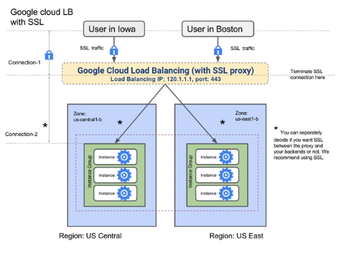
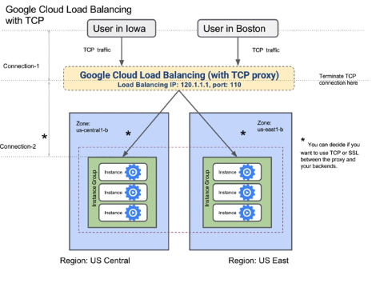

# SSL Proxy and TCP Proxy Load Balancing

### SSL Proxy Load Balancing

SSL operates in the session layer, below the application layer therefore less preferred.

**If traffic is encrypted but not HTTPS**, SSL proxy load balancing is what you should use.

| <h4>OSI Network Stack </h4>| <h4>Load Balancer</h4> |
|:-------------------------------:|:-------:|
| Application Layer | HTTP(S) |
| Presentation Layer | |
| <h4>Session Layer</h4>| <h4>SSL Proxy</h4> |
| Transport Layer | TCP Proxy |
| Network Layer | Network |
| Data Link Layer | |
| Physical Layer | |

 The above table shows where SSL proxy load balancing sits in the OSI network stack.
 
  - Traffic will flow over the interent using the IP protocol.
    - The network layer is the IP addresses, the transport layer is TCP and the application layer is typically HTTP.
 - For secure traffic, add the session layer (SSL) or at the application layer use HTTPS.

- Use for non-HTTP(S) SSL traffic
- For HTTP(S), just use HTTP(S) load balancing
- SSL connections are terminated at the global layer and then proxied to the closest available instance group

Here is a block diagram of SSL proxy load balancing

1. Users have a secure connection to the SSL proxy. 
2. This is external traffic and it hits the global SSL proxy load balancer VIP. (**Global external load balancing**)
3. The SSL connection that the load balancer recieves from the clients is terminated at the SSL proxy. This means a cert must be installed on the proxy.
4. The proxy makes fresh connections to the backends - this connection can be SSL or non-SSL.
5. The fresh SSL connection is made to the closest available instance group.

### TCP Proxy Load Balancing

- Performs load balancing based on the transport layer (TCP).
- Allows you to use a single IP address for all users around the word.
- Automatically routes traffic to the instances that are closes to the user.

| <h4>OSI Network Stack </h4>| <h4>Load Balancer</h4> |
|:-------------------------------:|:-------:|
| Application Layer | HTTP(S) |
| Presentation Layer | |
| Session Layer| SSL Proxy |
| <h4>Transport Layer </h4>|<h4> TCP Proxy </h4> |
| Network Layer | Network |
| Data Link Layer | |
| Physical Layer | |

 - Advantage of transport layer load balancing:
   - More intelligent routing possible that with network layer load balancing.
   - Better security - TCP vulnerabilities can be patched at the load balancer itself.
   

Here is a block diagram of TCP proxy load balancing
   
  
  
  It looks very similar to SSL proxy, but the traffic is not encrypted.
  
  Proxy makes new connections to the backend - **these new can be TCP connections or even SSL connections.**