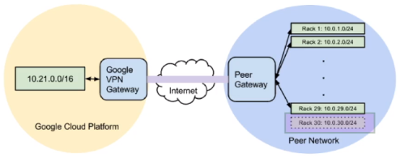

# Cloud Router

In order to avoid manually updating and adding static routes for new networks a cloud router can be used to dynamically exchange routes between GCP VPC's and on premise networks.

A cloud router is not a physical device, it’s a massively scalable, fully distributed and managed GCP service.

A cloud router can be configured to work with the VPN gateway you have configured for a VPC. The cloud router can then exchange and propagate topology information with on-premise (remote) network and VPC. There is no need to configure static routes.

Peers with remote network using BGP.

### Static Routing for VPN Tunnels

Static routing obviously increases management overhead and has the following drawbacks:

-   Administrator needs to create and maintain a routing table.
-   A topology change at the remote end requires routes to be manually updated.
-   Cannot re-route traffic automatically in event of link failure.
-   Routers do not advertise routes to each other, they simply perform their own routing operation.

In the diagram above, we have an on-premise (right) network connected to a VPC via secure VPN between a gateway at either end.

If the new subnet highlighted in purple is added to the peer network then a new static route will have to be added to the VPC before it has reachability. In addition to adding a new route, the VPN tunnel has to be torn down and re-established to include the new subnet.

### Dynamic Routing for VPN Tunnels

Dynamic routing can be implemented using Cloud Router in GCP. The Cloud Router uses BGP to exchange route information between network peers. Any network change in the peer network or in the VPC is automatically propagated to the other end.

The networks automatically and rapidly discover changes.

This exchange of new information is not disruptive as VPN infrastructure does not need to be torn down and re-established.

The above diagram is a similar setup to the static routing diagram, but this time there is a cloud router present. A cloud router belongs to a particular network and it is regional. If you have a VPC that spans multiple regions and each region has a VPN gateway, then each region also needs its own cloud router. A cloud router can be used for multiple VPN gateways and VPN tunnels provided they are ins the same region.

In the above diagram the staging subnet has been added to the VPC network, the cloud router is aware of this change and has already advertised it to its peer using BGP. The same is true for any new subnet added to the peer network.

The IP addresses for the cloud router and the peer gateway router should both be link local addresses.

### Cloud Router Modes of Operation

Cloud routers have two modes of operation. These modes determine which subnets are advertised to remote peers.

#### Global Dynamic Routing mode

Cloud router advertises all subnets in the VPC network to peer router.

Subnets in both regions will be advertised to peer.

#### Regional Dynamic Routing mode

Advertises only those router in the cloud routers local region.

Only subnets in us-west1 will be advertised as the router is in regional mode.
