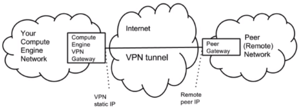

# Cloud VPN

## Three Interconnection Options

Once a GCP VPC has been created, there are three options to connect the VPC to on-premise networks or network with another cloud provider:

- **VPN using cloud router:**

    - This is a secure VPN tunnel between cloud router and on-premise network.

    - Can also be configured with static routes instead of cloud router - more manual overhead.

- **Dedicated Interconnect:**

    - This is a physical connection between VPC and on-premise network.

    - Data transfer can be much higher than VPN and costs can be lower.

- **Direct and Carrier Peering:**

    - Enterprise grade connection to allow for hybrid cloud workloads.

    - **Direct Peering:**

        - Direct from on-premise network to VPC.

    - **Carrier Peering:**

        - 3rd party (usually internet carrier) facilitates the peering.

## VPN

- Connects your on-premise network to Google VPC. Traffic is secured in an IPSec tunnel after being encrypted at one end by the VPN gateway and then decrypted at the other end by another VPN gateway.
- Offers 99.9% service availability SLA.
- Supports **site-to-site VPN**. This allows multiple sites to establish VPN tunnel to same cloud VPN gateway and VPC.
- Supports both static and dynamic routes for traffic between on-premise and cloud. Dynamic routing is done via the cloud router running BGP with the on-premise router. When the network changes automatic updates are send.
- Max speed of 1.5Gbps





The above diagram shows a remote network (remote because it's not GCP VPC) on the right connecting to GCP via VPN. This remote network can either be another cloud VPC or an on-premise network. Only IPSec gateway to gateway tunnels are supported, this will not work with client software on a PC (AnyConnect). There must be a dedicated VPN gateway on the client side. Cloud VPN also does not work with SSL VPN connections, the client VPN gateway must support the full suite of IPSec protocols. 
Peer network CIDR ranges must not overlap with VPC networks.

**Max of 8 tunels supported over VPN gateway**.

VPN will have higher latency and lower throughput as compared with dedicated interconnect and peering options. This is due to the fact that the VPN has to traverse the internet. Not the best options for hybrid cloud workloads with mass data transfer.


### Configure VPN using Cloud Shell

The following steps are to establish a VPN tunnel using the cloud shell:

1. Set the project using the correct project-id
```bash
gcloud config set project<project−id>
```
2. Create VPN gateway
```bash
gcloud compute target−vpn−gateways \
create <vpn−name> \
−−network <network−name> \
−−region <region>
```
3. Reserve external IP address:
```bash
gcloud compute addresses create<gw−ip−name> \
−−region <region>
```
4. Get the IP address you have reserved:
 ```bash
gcloud compute addresses list
```
5. Create three forwarding rules. These rules instruct GCP to send ESP (IPSec), UDP 500, and UDP 4500 traffic to the gateway.
```bash
gcloud compute forwarding−rules create <fr−name> \
−−region <region> \
−− ip−protocol ESP \
−−address <output from addresses list>\
−−target−vpn−gateway <vpn−gw−name>
```
```bash
gcloud compute forwarding−rules create <fr−name> \
−−region <region> \
−− ip−protocol UDP
−−ports 500 \
−−address <output from addresses list>\
−−target−vpn−gateway <vpn−gw−name>
```
```bash
gcloud compute forwarding−rules create <fr−name> \
−−region <region> \
−− ip−protocol UDP
−−ports 4500 \
−−address <output from addresses list>\
−−target−vpn−gateway <vpn−gw−name>
```
6. Create the CPN tunnel to peer:
```bash
gcloud compute vpn−tunnels create <tunnel−name> \
−−peer−address <peer−ip>
−−ike−version <1/2> \
−−shared−secret <passphrase>
−−local−traffic−selector=0.0.0.0/0 \
−−remote−traffic−selector=0.0.0.0/0 \
−−target−vpn−gateway <vpn−gw−name> \
−−region <region> 
```
7. To verify a tunnel has been created:
```bash
gcloud compute vpn−tunnels list
```
8. Install static route to reach remote range via VPN tunnel:
```bash
gcloud compute routes create <route−name> \
−−network <network−name>
−−next−hop−vpn−tunnel <tunnel−name>
−−next−hop−vpn−tunnel−region <region>
−−destination−range <remote−ip−range>
```

Local and remote traffic selectors are for filtering at the tunnel. Leaving them open like in the example above means that if the routing table decided to send traffic to the tunnel then it will be let through.
The final step will create a static route with **default priority of 1000**, to specify a different priority use: 
```bash
−−priority
```
Its not possible to change a routes priority after its been created, so it will have to be deleted.
