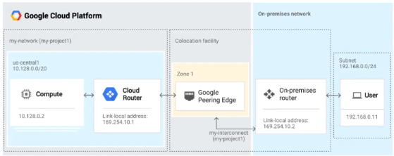

# Dedicated Interconnect, Direct and Carrier Peering

## Dedicated Interconnect

Direct physical connection using 1918 private addresses between on-premise network and cloud VPC.
Because the dedicated interconnect is a physical connection, the throughput can be very large and is suitable to cloud migrations involving larger amounts of data.
The dedicated interconnect does not use the internet and has high bandwidth this can sometimes be more cost effective that using a high bandwidth internet connection and VPN.
A single dedicated interconnect connection has a bandwidth of 10Gbps. A maximum of 8 connections is supported between on-premise and VPC network.
If you do not need a throughput of 10Gbps then a cloud VPN might be more suitable. Data is not encrypted over the dedicated interconnect, if data security is required then application layer encryption is needed.

The above diagram shows two networks connected using a dedicated interconnect the interconnect exists in a colocation facility where the on-premise network and googles network meet physically. The link will be a single or multiple 10Gbps link. If you have multiple links to google or links to different devices, you must create separate interconnects. Google offers a list of colocation facilities to peer with google.

It is best practice to use a cloud router with BGP for dynamic routing updates.

Because both networks are using internal 1918 address space, the cost of egress traffic from the VPC to on-premise network is reduced.

## Direct Peering

With direct peering, google allows you to establish a direct peering between your network and googles. This connection can be setup in any of 70 locations in 33 countries.

-   Direct connection between on-premise network and google at googles **edge network locations.**
-   BGP is used for dynamic routing.
-   Direct peering can be used to reach all of googles services not only the full suite of GCP products.
-   Need to meet googles technical requirements:

-   Single mode fibre 10GBASE-LR
-   Specific MTU size
-   IPv4 link local addressing
-   EBGP with multi-hop
-   802.1q VLANs
-   LACP

-   Establishing direct peering is free however there is a special billing rate for GCP egress traffic, other traffic billed at standard GCP rates.

## Carrier Peering

-   Enterprise grade network connecting your infrastructure to google using a service provider.
-   Can get high availability and lower latency using one or more links.
-   No google SLA, the SLA depends on the carrier.
-   Special billing rate for GCP egress traffic, other traffic billed at standard GCP rates.