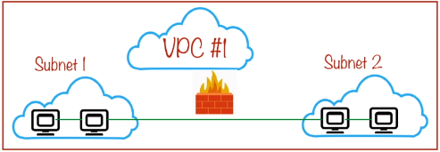

# Firewall Rules

Protects your VM instances from unapproved connections, both ingress and egress. You can create firewall rules to allow or deny specific connections based on a combination of IP address, ports and protocol.

<https://cloud.google.com/vpc/docs/firewalls>

In the example above we have a VPC with multiple subnets configures, the subnets and resources within the subnets can communicate with each other using hostnames and internal IP's. The DNS on this network knows the hostnames and IP address mapping for each host. The VPC also has a route to and from every instance on the network.

The route alone is not enough, also need to configure firewall rule for traffic to traverse this route.

Even though a network is a trusted environment and all resources in a network trust each other and communicate using internal IP addresses, firewall rules must still be created to permit traffic within the VPC. GCP firewall rules are stateful.

### What is a Firewall Rule made of ?

-   **Action**: Allow or Deny.
-   **Direction**: Ingress or Egress. This is in relation to the instance the rule is for.
-   **Source IP's**: For ingress rules.
-   **Destination** IP's: For egress rules.
-   **Protocol and Port**: Port number of application or protocol.
-   **Specific instance names**: All instances in network if empty. To specify an instance a tag can be used.
-   **Priorities and Tiebreakers**: In case of conflicting rules, the higher priority rule is used.

### Rule Assignment

The default behaviour is that every rule is assigned to every instance in the network. Firewall rules are associated to a particular network.

Rule assignment can be restricted using tags or service accounts:

-   Allow traffic from instances with a tag of "database"
-   Deny traffic to instances running as service account "terraform@tf-admin.gcpserviceaccount.com"

## Service Accounts vs Tags

The below table summarises why **service accounts should be preferred** to tags to group specific instances so that firewall rules can be applied.

| **Service Accounts** | **Tags** |
|:-------------------------|:-----------|
|Represents the identity that the instance runs with.| Logically group resources for billing or applying firewalls.| 
An instance can have just one service account. Very specific.| An instance can have a number of tags ~256?  Less specific to the instance.|
| Restricted by IAM controls, permission to start an instance with a service account has to be explicitly given. More secure.| Tags cane be changed by any user who can edit an instance. Less secure.|
| Changing service account for an instance requires stopping and restarting it.| Changing tags is metadata and is a much lighter operation.|

## Firewall Rule Characteristics

-   Currently only IPv4 addresses are supported in a firewall rule.
-   Firewall rules are specific to a network. They cannot be shared between networks unless using a shared VPC. A shared VPC is a single network after all.
-   Tags and service accounts cannot be used in the same rule. They are mutually exclusive in the same rule.

### Default and Implied Rules

Every VPC network has two implied firewall rules. These rules exist, but are not shown in the console:

- An implied **"allow egress"** rule:
  - Allows all egress connections.
  -   Rule has a priority of 65535 (lowest possible)
  -   Destination of this rule is 0.0.0.0/0
  -   Outbound traffic can be restricted by a higher priority rule

- An implied **"deny ingress"** rule:
  -   Denys all ingress connections.
  -  Rule has a priority if 65535 (lowest possible)
  -  Source of this rule is 0.0.0.0/0
  - Inbound traffic can be allowed by a higher priority rule

The implied rules cannot be removed, but as they have the lowest possible priorities, they can be overridden with priority numbers less than 65535. 

#### Firewall Rules for the "default" Network

Every project gets a default auto-mode network automatically created for it. This means it has a subnet for every region created for it automatically. As well as these subnets it also has some firewall rules that are automatically set up for it in addition to the implied rules above that are set up for all networks:

- The **default-allow-internal** rule:

  - Allows ingress network connections of any protocol and port between VM instances on the network. This is why VM's that are created on the default network can communicate with no extra config.

- The **default-allow-ssh** rule:

  - Allows ingress TCP connections from any source to any instance in the network over port 22.

- The **default-allow-icmp** rule:

  - Allows ingress ICMP traffic from any source to any instance on the network.

- The **default-allow-rdp** rule:

  - Allows ingress remote desktop protocol traffic (tcp/3389).