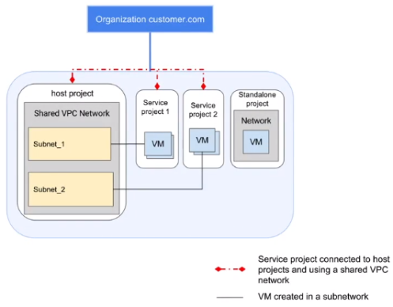
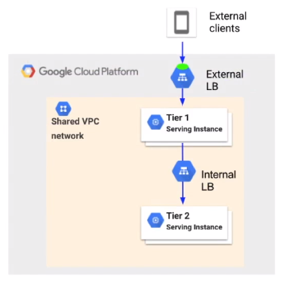

# Shared VPC

## Connecting VPC Networks

Establishing connections between VPC networks can be achieved with the following options:

1. Shared VPC
2.  VPC Network Peering

### Shared VPC

A shared VPC is used when you have multiple projects but only one VPC. It used to be known as XPN (Cross-Project Networking).
The shared VPC allows for cross project networking(spans multiple projects). It is a shared network and not some kind of interconnect or tunnel between networks.
Creates a VPC network of 1918 address space that associated projects can use.
Firewall rules and policies apply to all projects on the network. This is not the case with interconnects, each end of the interconnect has their own firewall rules.

In the above example, there are four projects, Host Project, Service Project 1, Service Project 2 and a Standalone Project. The dotted red line represents the shared VPC connection. The two service projects don’t have a network of their own as they use the host projects. The standalone project has its own network as its not using cross project networking. 

**The Host Project** is the project that hosts the sharable VOC networking resources **within a Cloud Organization**.

**The Service Project** is the project that has permission to use the shared VPC networking resources from the host project.

**The Standalone Project** is the project that does not need to share networking resources with any other project in the organization. This project will have its own VPC.

**The shared VPC network** is a VPC network owned by the host project and shared with one or more service projects **in the same organization**. The firewall rules applied to the shared VPC will be used by all projects part of the shared VPC.

In order to share a VPC, the permissions must be set at organizational level. XPN admin or shared VPC admin.

It is possible to share only a set of subnets from shared VPC to service projects.

#### Host and Service Projects

There are a few basic rules to follow when setting up a shared VPC:

-   A service project can only be associated with a single host. Your cant have the same service project associated with multiple host projects.
-   A project cannot be a service and host project at the same time.
-   Existing projects can join shared VPC networks.
-   Any instances that have already been created cannot be migrated over to the shared VPC, you must explicitly create new instances on the shared VPC.
-   Cross project traffic is billed at the same rate as intra project traffic.
-   Egress traffic is attributed to the project where the instance lives, not always the host project.

### Use Case: Two Tier Web Service

A standard use case for a shared VPC is a two-tier web service.

In this example a different team owns the Tier 1 and Tier 2 services. 
An external client hits the external LB and then the front end of the web service, the request is then load balanced to the database backend. Tier 1 and 2 are in different projects but belong in the same network as they are both a part of an application.
Having this project level separation allows each team to deploy and operate its services independently. For example if there is a front end update but none of the backend API's have changed then we can just update Tier 1.
Each project is billed separately and each project admin can manage their resources separately.
Another advantage of the shared VPC is that it allows for a single group of network and security admins to be responsible for the shared VPC. They will be in charge of network connectivity and security rules for the organization as a whole. This is opposed to each project having its own network and security team or the network admins having to manage and maintain loads of small project level networks rather than a few shared VPC.