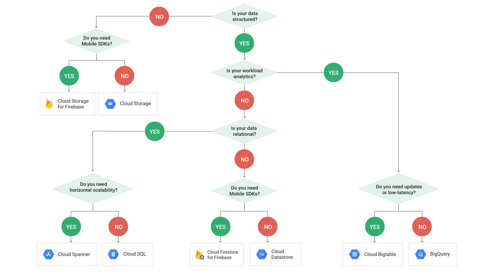

 # Storage Options
 
 ## Overview Scenarios

 - Block Storage for compute VM's - **Persistent disks or SSD's.**
 - Immutable blocs like video/images - **Cloud Storage.**
 - OLTP (transaction processing) - **Cloud SQL** (MySQL or Postgres) or **Cloud Spanner** (Google proprietary).
 - NoSQL HTML/XML - **Datastore**.
 - NoSQL Key-values - **BigTable**. (Similar to HBase)
 - Getting data into Cloud Storage - Transfer service.

 

**Databases are an abstraction on file storage. File storage is an abstraction on block storage.** Block storage refers to the kind of storage carried out by application directly. If you refer to data using a physical hardware address, that is block storage. If you refer to data using a logical hierarchical directory address, that is file storage. One level of abstraction higher would be to refer to the data using a query language like SQL.
**Block storage is one level below file storage in abstractions.**

### Use Cases

| <h4>When you need: </h4>|<h4>Example</h4>| <h4>Use</h4> |<h4>GCP Tool</h4>|
|:-------------------------------|:-------|:-----------------|:----------------------|
| Storage for Compute, Block Storage | Structured block data, SAN| Persistent (hard disks or SSD) | Persistent (hard disks or SSD) | 
| Storing media, Blob Storage |Unstructured, blob data | File system - maybe HDFS | Cloud Storage |
| SQL interface on top of data, Analytics/Data Warehouse (OLAP)  |Large scale data analytics, data processing using SQL| Hive (SQL-like, but really its MapReduce on HDFS) | BigQuery |
| Document database, Semi-structured, NoSQL | Game State, inventories, user profile | CouchDB, MongoDB (key-value/indexed database) | DataStore/Firestore | 
| Fast scanning, NoSQL, high throughput analytics |Graphs, IoT data, finance | HBase, Cassandra (columnar database) | BigTable | 
| Structured data | Medical records, Blog| RDBMS | Cloud SQL | 
| Transaction Processing (OLTP) | Global retail shop | RDBMS + scalability |  Cloud Spanner | 

### Mobile-Specific Use Cases

| <h4>When you need: </h4>| <h4>Use</h4> |
|:-------------------------------|:-----------------| 
| Storage for Compute, Block Storage along with mobile SDKs | Cloud Storage for Firebase | 
| Fast random access with mobile SDK's | Firebase Realtime DB | 

### GCP to Open source matchup

|<h4>Open Source</h4>| <h4>GCP</h4>|
|:--------------------------:|:-------------:|
|MongoDB| Datastore|
|HBase|BigTable|
|Hive|BigQuery|

## Summary

- Block Storage for compute VM's  - Persistent disks or SSD's
- Immutable file blob storage like video/images - Cloud Storage DataProc does not use HDFS but Cloud Storage underneath  
- OLTP - Cloud SQL or Cloud Spanner
- OLAP - BigQuery
- NoSQL Documents (HTML/XML) - Datastore
- NoSQL Key-values - BigTable (~HBase)
- Getting data into Cloud Storage - Transfer Service

