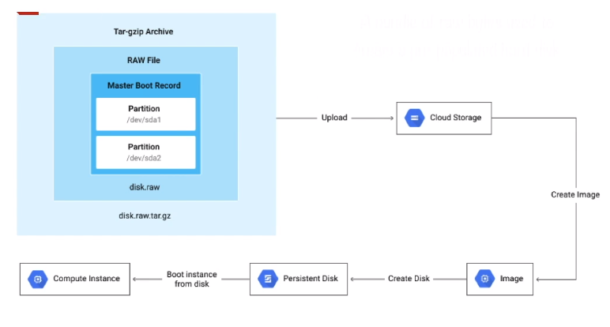

# Images

A VM is just a software implementation of a machine running on underlying hardware.

An **image of a VM is a copy** of this VM that may contain an OS, data files, applications, etc...

Images are generally used to create multiple identical VMs with all software pre-loaded.

- Used to create boot disks for VM instances.
- **Public images:**
  - Provided and maintained by Google, open source communities, third party vendors
  - All projects have access and can use them
- **Custom images:**
  - Available only to your project
  - Create a custom image from boot disks and other images

- Most of the public images can be used for no cost.
- Some **permium** images may have additional costs.
- Custom images that you import to compute engine add no cost to the instance.
  - They incur an **image storage charge** when stored in your project (tar.gz)
    - This is the same charge as any other blob storage in cloud storage
- Images are configured as part of the **instance template** of a managed instance group.
  - This is so instance groups can auto-scale

### Image Contents

An image is a tar.gz file that is made up of:
- Boot loader
- OS
- File system structure
- Software
- Customization

Below is a diagram showing the steps to create a VM insance from an image.

An image is basically a bundle of raw bytes inside a tar.gz file with everything needed to create a pre-populated hard-disk.

Once the tar.gz has been uploaded to cloud storage, it must be registered as an image in compute engine.

## Premium images

- Additional per second charges, same across the world
  - If the software needs a lisence to be used normally, then it is a permium image.
    - rhel, windows, etc
- Per second charge changes based on machine type
- SQL server charges per minute 