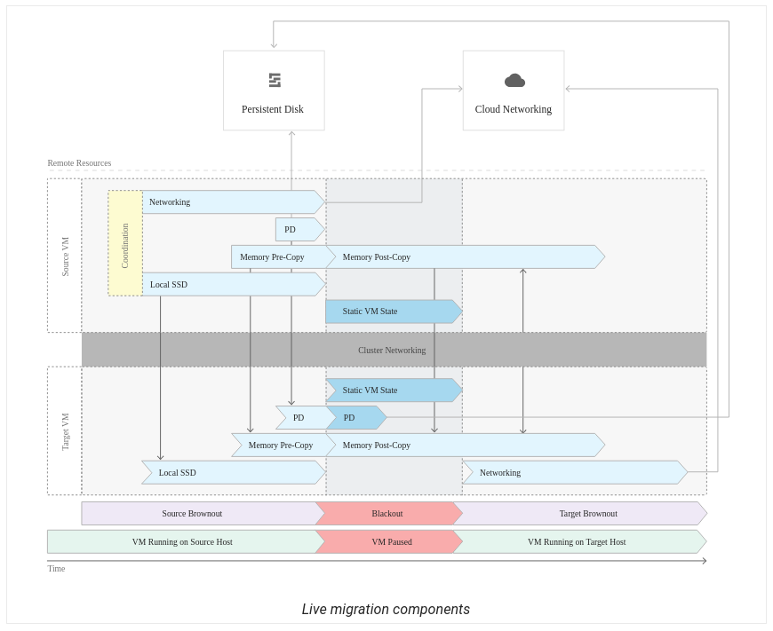

# Live Migration

VM's offer a feature known as live migration, it allows them to remain up even during maintenance events.
When a VM must go down for maintenance, all of its data and state is transfered to another one to carry on.

#### Live Migration features:

 - Keeps your VM instances running even during a hardware or software update.
 - Live migrates your instance to another host in the same zone **without rebooting the VM**.

Circumstances that could cause host machines to go down:

- Infrastructure maintenance and upgrades
- Network and power grid maintenance
- Hardware failure
- Host and BIOS updates
- Security changes
- Etc...

Live migration will ensure that your instance is moved to a host that is not subject to the same downtime.

Live Migration summary:

 - VM gets a notification that it needs to be evicted in 60 mins. All the applications and running state needs to be shut down and moved.
 - GCE will choose a new host in the same zone as the target VM. This host is not subject to the same maintenance and is ready to have OS's and applications deployed onto it.
 - A connection needs to be established between the VM being evicted and the target host. This connection will be authenticated.

Live Migration stages:

 - **Pre-migration brownout:** VM is still running on the source while most of the state is sent from the source to the target. GCE will copy all the guest memory from the source while keeping track of any changes.
 - **Blackout:** A very brief moment when the VM is not running anywhere.
 - **Post-migration brownout:** VM is on the target, the source is present and might offer support. For example, if routing tables have not updated yet, any packets sent to the source will be forwarded to the target by the source.

 Below is a timeline diagram of how a Live Migration occurs.
 

The diagram shows the order of operations during a live migration. 

Instances with GPU's cannot be live migrated currently.