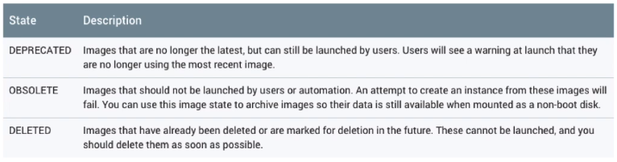
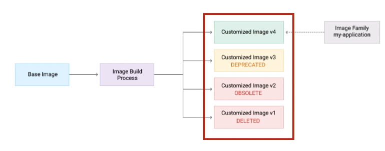
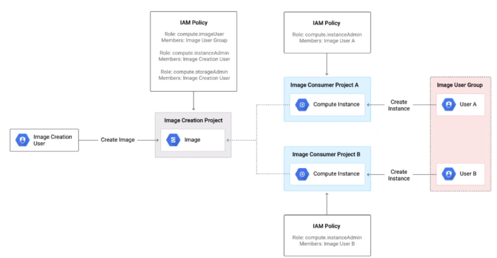

# Startup Scripts

 - Used to customize the instance created using a public image
 - The script runs commands as it boots
 - Scrips to be run at startup should be **idempotent** to avoid inconsistent or partially configured state
   - During the boot of a VM, it is possible that the startup script is run multiple times. An idempotent script will result in the same state regardless of how many times the script was run

### Baking

A much more efficient way to provision infrastructure. If you need to create a load of VM's with the same configuration the na baked image is the way to go. Startup scripts are less reliable.
 1. Start with a public image and then customize it.
 2. Save it as an image.

## Startup Scripts vs Baking

| Startup Scripts | Baking |
|-----------------|---------|
| Longer for the instance to be ready | Much faster to go from boot to application readyness | 
| Might fail and needs to be idempotent | Much more reliable for application deployments | 
| Rollback has to eb handled for application and image separatley | Version management is easier, easier to rollback to previous versions | 
| The script will needd to install dependencies during application deployment | Fewer external dependencies during application bootstrap | 
| Each deployment might reference different versions if the latest version of the software has changed | Scaling up creates instances with identical software versions |

## Image Lifecycle

Once you stert using custom images, its very normal to have several versions of an image.

The below image illustrates the image versioning process.

- Image V1 cannot be used as its been deleted.
- Image V2 cannot be used as its been marked das obsolete.
- Image V3 can be used but users will get warning.
- Image V4 is the current image.

## Sharing Images Between Projects

One of the main benefits of using images is that they can be shared between projects. They can be stored in cloud storage.
Below is a diagram of how you would crate images to be shared across multiple projects.

1. A user who has IAM roles to do so, will create a image, save it to cloud storage and register it as an image.
2. Project A will have its own owners, as long as they have compute.ImageUser for the image creation project, they will be able to spin um a VM in their own project using the custom image.
3. The same is true for project B.
4. Both of these created VM's will be identical as they are based of the same image.